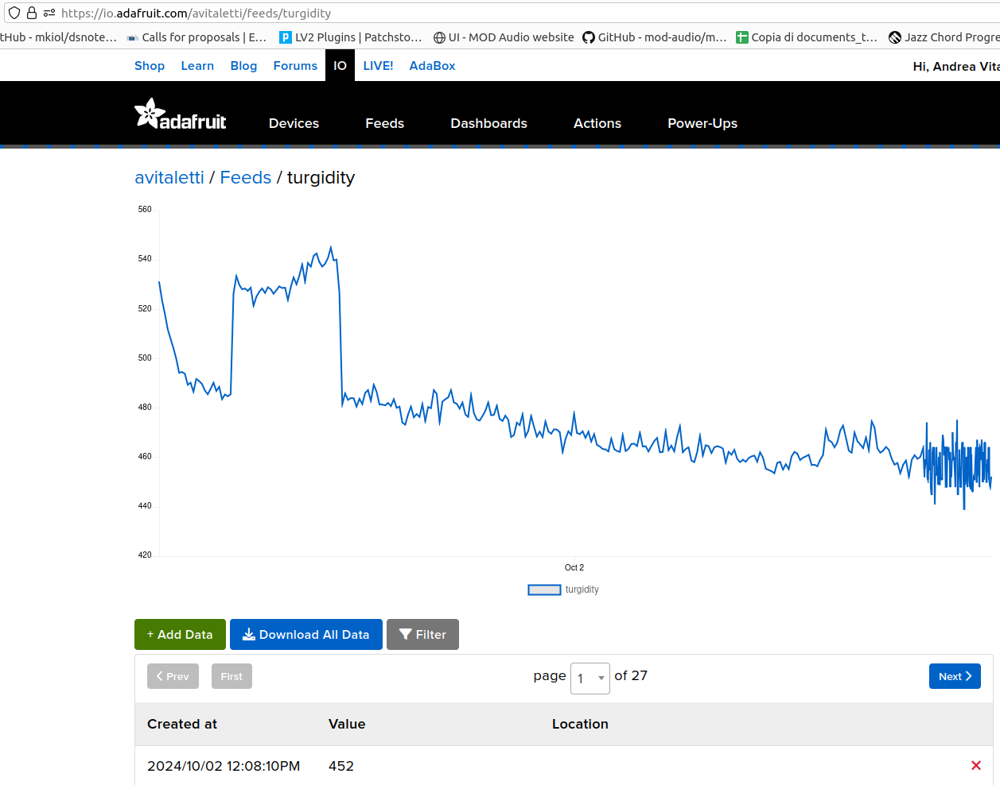
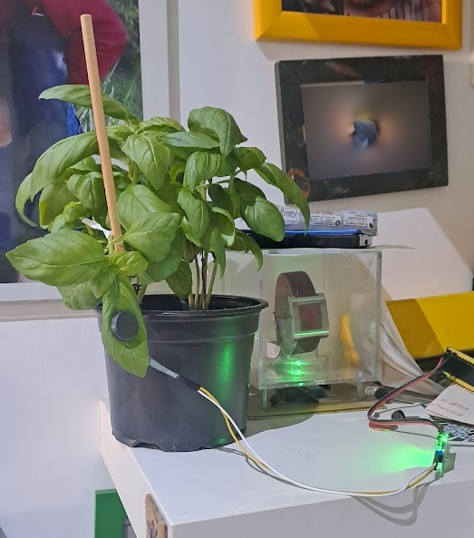

# Turgor experiment

A simple experiment to record the variation in turgor of plants leaves. The sensor is an [FSR402](https://www.amazon.it/dp/B09KP9VCHY?ref=ppx_yo2ov_dt_b_fed_asin_title) kept in  position by two [magnets](https://www.amazon.it/dp/B0CC1F5N91?ref=ppx_yo2ov_dt_b_fed_asin_title). The sensor is interfaced with an EPS32 connected via MQTT to [adafuit.io](https://io.adafruit.com/avitaletti/feeds/turgidity)  

The lower he value the higher the pressure. Now the basili plant is pretty well watered, so I expect low values due to the high turgor pressure. 

I will stress the plant (sorry for that) not watering it in the next days, hopefully the values measured by the sensor will increase, showing a lower turgor pressure. 